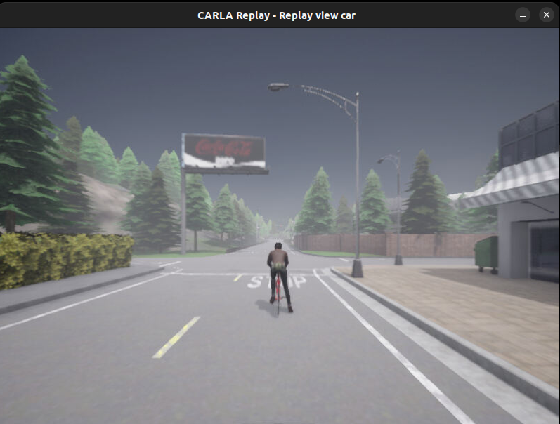
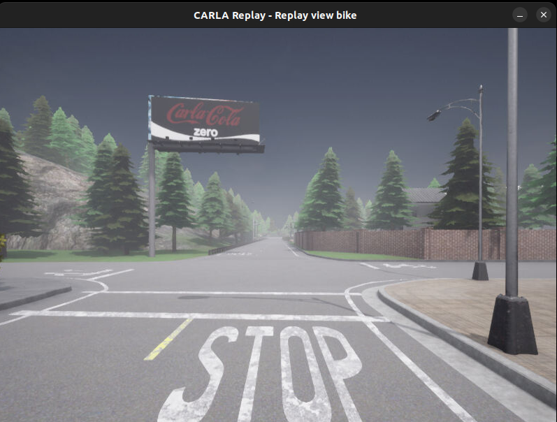

# carla_recorder_replay

This code ilustrates how to use the recorder and replay functions in CARLA (0.9.15) simulator. Please refer to the [official documentation](https://carla.readthedocs.io/en/latest/adv_recorder/) for more details

## Recorder

Run **recorder.py** to record a CARLA log in the following scenario. A car drives with autopilot enabled, while a bicycle is positioned in front of it.


Keep in mind that the recorder does not saved any data related with the sensors attached to the vehicles. It only stores the information required to accurately reproduce the scenario and its dynamics.

Typically the recorder is executed in **asynchronous mode**, so the client does not wait for the ticks generated by the simulator. You can enable the autopilot or drive the vehicle manually using a external controller.


# Replay

Run **replay.py** to reproduce the CARLA log previously saved with the recorder. 

Typically replay is executed in **synchronous mode** when generating synthetic datasets. This ensures that no frames or events are missed during the simulation. However, you can also replay the log in asyncronous mode if needed.

Dive in to the code of the **replay.py** script, and see how you can change the point of view of the actor (vehicle or bike) from which you want to analyze the simulation.

You can see below how you can run the same simulation twice from different points of view.


| Car View | Bike View |
|----------|----------|
|  |  |

## CARLA simulator

Both examples described above require the **CARLA simulator** to be running in the following way


```bash
./CarlaUE4.sh -RenderOffScreen -carla-world-port=3010 
```
