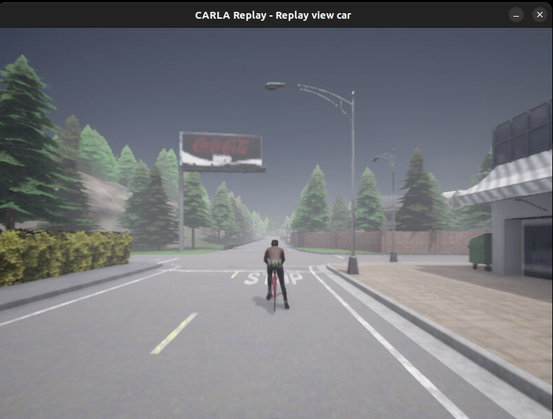
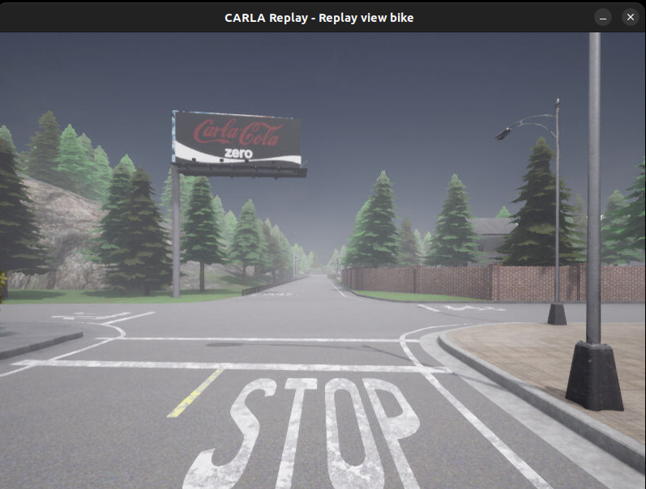
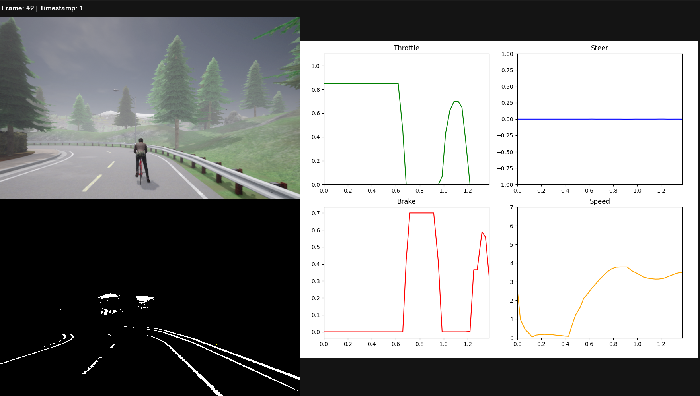

# carla_recorder_replay

This code ilustrates how to use the recorder and replay functions in CARLA (0.9.15) simulator. Please refer to the [official documentation](https://carla.readthedocs.io/en/latest/adv_recorder/) for more details

You can run CARLA as following:

```bash
./CarlaUE4.sh -RenderOffScreen -carla-world-port=3010 
```

# Recorder

Run **recorder.py** to record a CARLA log in the following scenario. A car drives with autopilot enabled, while a bicycle is positioned in front of it.


Keep in mind that the recorder does not save any data related with the sensors attached to the vehicles. It only stores the information required to accurately reproduce the scenario and its dynamics.

Typically the recorder is executed in **asynchronous mode**, so the client does not wait for the ticks generated by the simulator. You can enable the autopilot or drive the vehicle manually using a external controller.

As the recorder does not save any sensor data, and we want to know the car's speed while replaying the log file, we will be using a csv file. In that file, we will store two variables: current timsetamp and speed.  
Later, while doing the replay, we will join speed data with the rest of the sensor data.

```
$ python3 recorder.py --help
pygame 2.6.1 (SDL 2.28.4, Python 3.10.16)
Hello from the pygame community. https://www.pygame.org/contribute.html
usage: recorder.py [-h] [--log_path LOG_PATH] [--town TOWN] [--port PORT] [--tport TPORT] [--extra_actor]

recorder

options:
  -h, --help            show this help message and exit
  --log_path LOG_PATH   Directory where log files will be stored
  --town TOWN, --carla-town TOWN
                        Name of the CARLA map to load
  --port PORT, --carla-port PORT
                        Port used to connect to the CARLA simulator
  --tport TPORT, --carla-traffic-port TPORT
                        Port used by the CARLA traffic manager
  --extra_actor, --carla-extra-actor
                        Spawn an additional actor in front of the ego-vehicle
```

```
python3 recorder.py --log_path ./test --town Town04 --port 3010
```

**recorder.py** saves data as following (in the specified log_path):

```
$ tree logs
logs
└── 1763717922_Town04
    ├── data.csv
    └── Town04.log
```

# Replay

Run **replay.py** to reproduce the CARLA log previously saved with the recorder. 

Due to CARLA limitations replay always execute in **asynchronous mode**. This script also creates a dataset if needed.

Dive in to the code of the **replay.py** script, and see how you can change the point of view of the actor (vehicle or bike) from which you want to analyze the simulation.

You can see below how you can run the same simulation twice from different points of view.


| Car View | Bike View |
|----------|----------|
|  |  |


For the replay, as the speed csv that we created in the record was taken at **30FPS** in asynchronous mode, we need to do the replay in the same conditions so that the speed  data matches the other data (throttle, breaks, steering...).  To make sure that frames are not missed in this **asynchronous** mode, we will be using a Queue (python queues have their own locks)

For creating datasets while replay the log, execute as follows:

```
python3 replay.py --log_path logs/1763717922_Town04/ --generate_dataset_path /tmp/
```

The latter will create a dataset ready to use:

```bash
$ ls /tmp/1763718805717_dataset/

-rw-rw-r--    31679 nov 21 10:53 dataset.csv
drwxrwxr-x    20480 nov 21 10:53 mask
drwxrwxr-x    12288 nov 21 10:53 rgb
# If semantic segmentation is enabled:
drwxrwxr-x    12288 nov 21 10:53 semseg
drwxrwxr-x    12288 nov 21 10:53 custom_semseg
```

### Semantic Segmentation (`semseg` vs `custom_semseg`)

When using `--dataset_types semseg custom_semseg all` in **replay.py**, the script can extract semantic segmentation images from CARLA. Two different directories can be generated, each with its own `labels.json` mapping the pixel values to their respective classes:

1. **`semseg`:** Provides the original, unedited semantic segmentation data directly from CARLA, preserving its 29 default categories:
   - `0: Unlabeled`, `1: Roads`, `2: SideWalks`, `3: Building`, `4: Wall`, `5: Fence`, `6: Pole`, `7: TrafficLight`, `8: TrafficSign`, `9: Vegetation`, `10: Terrain`, `11: Sky`, `12: Pedestrian`, `13: Rider`, `14: Car`, `15: Truck`, `16: Bus`, `17: Train`, `18: Motorcycle`, `19: Bicycle`, `20: Static`, `21: Dynamic`, `22: Other`, `23: Water`, `24: RoadLine`, `25: Ground`, `26: Bridge`, `27: RailTrack`, `28: GuardRail`

2. **`custom_semseg`:** Provides a mapped and simplified version of the original semantic data (typically used for GAIA project), grouping the original 29 classes into 8 key macro-categories designed for autonomous driving tasks:
   - `0: Background` *(Unlabeled, Sky, Static, Dynamic, Other, Water)*
   - `1: Road` *(Roads, RoadLine, Ground, RailTrack)*
   - `2: Sidewalk` *(SideWalks)*
   - `3: Obstacles` *(Building, Wall, Fence, Bridge, GuardRail)*
   - `4: Vegetation` *(Vegetation, Terrain)*
   - `5: Poles_and_Signs` *(Pole, TrafficLight, TrafficSign)*
   - `6: Vehicles` *(Car, Truck, Bus, Train, Motorcycle, Bicycle)*
   - `7: Pedestrians` *(Pedestrian, Rider)*


## CARLA simulator

Both examples described above require the **CARLA simulator** to be running in the following way


```bash
./CarlaUE4.sh -RenderOffScreen -carla-world-port=3010 
```

## Visualize data

There is also a script called **visualize_dataset.py**, where you can visualize all the dataset at once. Here is an example of the result: 

